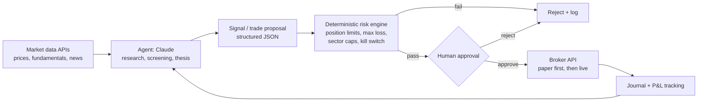

Yes, Claude can help a lot with stock trading, but mostly as an **analyst and engineer**, not as the thing that decides what to buy. Agentic AI makes the workflow faster, though it doesn't fix the core problem that LLMs aren't reliable price predictors. (I'm not a financial advisor; this is about tooling and architecture.)

## Where Claude adds real value

| Area | What Claude does well |
|---|---|
| **Research** | Summarizing 10-Ks/10-Qs, earnings call transcripts, 8-K events, and guidance changes; comparing a company against its peers |
| **Screening logic** | Turning a thesis ("FCF-positive, debt/EBITDA < 2, revenue growth > 15%") into screener code or queries |
| **Code** | Writing Python for data pulls (yfinance, Polygon, Alpaca, IBKR APIs), indicators, backtests (backtrader, vectorbt), and portfolio analytics |
| **Backtest critique** | Spotting look-ahead bias, survivorship bias, overfitting, and unrealistic fill or slippage assumptions |
| **Options/risk math** | Explaining Greeks, payoff profiles, position sizing, and drawdown and Kelly-style reasoning |
| **Discipline** | Writing up trade theses, keeping a journal, and running post-mortems ("was this a process failure or variance?") |
| **Sentiment/news triage** | Classifying headlines and filings by relevance and tone at scale |

## Where it does *not* help

- **Predicting prices.** LLMs have no edge in forecasting short-term moves. Confident-sounding calls are not signal.
- **Low latency.** LLM response times (seconds) are useless for HFT or scalping.
- **Exact numbers.** Claude can misstate figures if it isn't grounded in a data source. Always pull numbers from an API or filing, not from model recall.
- **Repeatability.** Responses vary from run to run, so you can't backtest an LLM's "judgment" the way you backtest a rule.
- **Untrusted inputs.** News, social posts, and filings can contain prompt injection. Any agent that reads web content and can place orders is an attack surface.

## Does agentic AI help? Yes, if you scope it correctly

The pattern that works is: **the LLM reasons and proposes; deterministic code enforces risk and executes; a human approves.**

The agentic pieces that are worth building:

1. **Scheduled research agent.** Each morning it pulls overnight news, earnings, and pre-market movers for your watchlist and writes a brief.
2. **Filing monitor.** It watches EDGAR for new filings on your holdings and flags material changes (guidance cuts, insider sales, going-concern language).
3. **Screener plus thesis drafter.** Code runs the quantitative screen; Claude writes a bull and bear case for each hit.
4. **Trade proposer.** It outputs structured orders (ticker, side, size, stop, rationale). These are never executed directly. They go through hard-coded risk rules, then to you.
5. **Post-trade reviewer.** It compares outcomes to the original thesis and builds up your decision log.

## How to actually build it

- **Claude Code or the API with tool use.** Write the pipeline in Python: data connectors, risk engine, and broker client. Alpaca is the easiest place to start, with a free paper-trading API. IBKR is more capable but has more friction. Your Python level is enough for this, especially with Claude writing most of the code.
- **MCP servers** can expose market data and your portfolio to Claude as tools, so the agent queries real numbers instead of guessing them.
- **Claude in Excel** works well if your models live in spreadsheets (DCFs, position sizing, scenario tables).
- **In claude.ai itself**, Claude won't place trades for you through the browser agent. Execution stays with you or with code you own and run against your broker's API.

## Guardrails worth hard-coding (not prompting)

- Max position size and max daily loss, enforced in code rather than in the system prompt
- A kill switch and an order-rate limit
- Paper trading for weeks before any live capital
- Logging of every prompt, tool call, and proposal, so you can audit why the agent proposed something
- No direct path from "agent read a web page" to "order sent" without the risk engine and your approval
- Awareness of regulatory constraints like the pattern-day-trader rule and wash sales if you trade frequently

**Bottom line:** Claude is very good at making *you* a faster, more disciplined, better-informed trader, and at building the tooling around your process. A fully autonomous "AI picks and trades stocks" agent is where the risk is highest and the evidence of edge is weakest.

I can sketch a starter repo layout for the research agent, risk engine, and Alpaca paper-trading setup if you want to go that route.
