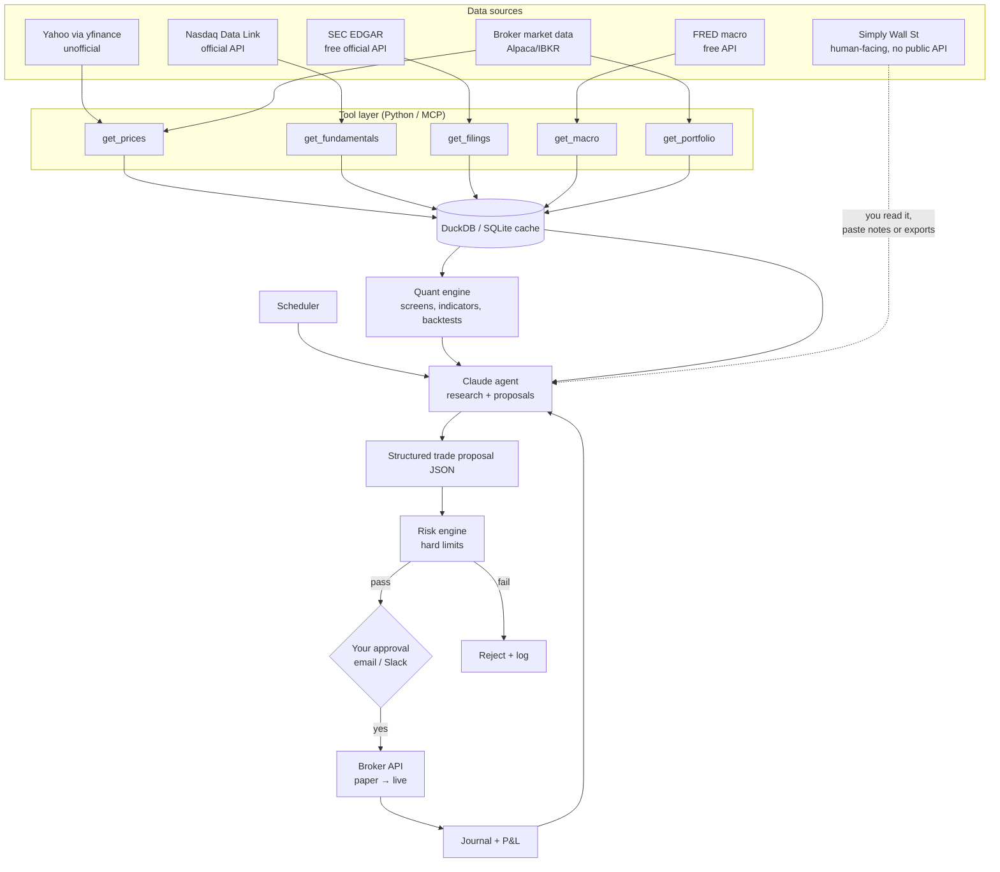

An agentic trading setup comes down to about eight components. Your data sources fit in three ways: some have a clean API, some are usable but unofficial, and some (like Simply Wall St) are mainly for you to read rather than for the agent to call.

## Core components

| # | Component | Purpose | Typical implementation |
|---|---|---|---|
| 1 | **LLM / agent runtime** | Reasoning, summarization, thesis writing, choosing which tool to call | Claude via API (tool use), or Claude Code to build and run it |
| 2 | **Tool / data layer** | Gives the agent *real* numbers instead of model recall | Python functions exposed as tools, or MCP servers wrapping each data source |
| 3 | **Data store** | Cache prices, fundamentals, filings, and agent outputs; avoids re-pulling and rate limits | SQLite or DuckDB to start; Postgres later |
| 4 | **Orchestrator / scheduler** | Runs jobs on a schedule (pre-market brief, post-close review, filing watch) | cron, APScheduler, or GitHub Actions on a schedule |
| 5 | **Quant / screening engine** | Deterministic math: ratios, indicators, screens, backtests | pandas, vectorbt or backtrader, ta-lib / pandas-ta |
| 6 | **Risk engine** | Hard limits the LLM cannot override | Plain Python: position caps, max daily loss, sector limits, kill switch |
| 7 | **Execution layer** | Places orders, paper first | Broker API (Alpaca, IBKR, Schwab, Tradier) |
| 8 | **Observability / journal** | Logs every prompt, tool call, proposal, and fill; P&L attribution | Structured JSON logs plus a simple dashboard (Streamlit), or Splunk if you want to reuse what you know |

Optional additions: a notification channel (email or Slack for briefs and approval requests) and a vector store if you want the agent to search years of filings or your own notes.

## Reference architecture

## Your data sources: what's usable and how

| Source | Programmatic access | Notes / caveats |
|---|---|---|
| **Yahoo Finance** | `yfinance` Python library | Unofficial. It scrapes Yahoo's endpoints, so it breaks periodically and isn't licensed for commercial use. Fine for personal research and backtests; don't make a live system depend on it alone. |
| **Nasdaq** | **Nasdaq Data Link** (formerly Quandl) has an official API with free and paid datasets | nasdaq.com's own site endpoints are unofficial and get blocked often. Use Data Link. |
| **Simply Wall St** | No public retail API that I could find | The integrations I found are partner-level (Sharesight, Class), not something a subscriber can call. Scraping would likely violate their ToS. Use it as **your** research layer: read the snowflake and valuation, then paste key notes or any exports into the agent's context. |
| **SEC EDGAR** | Free official API (`data.sec.gov`), including XBRL company facts | Probably the most valuable free source. It provides authoritative fundamentals and filings and requires a descriptive User-Agent header. |
| **FRED** | Free API key | Rates, CPI, yield curve, and unemployment, for macro context. |
| **Broker data** | Alpaca, IBKR, Schwab APIs | Alpaca's free tier gives IEX-only real-time quotes. Full SIP data is paid. |
| **Other free tiers** | Alpha Vantage, Finnhub, Financial Modeling Prep, Polygon | Free tiers are rate-limited. Good for filling gaps such as earnings calendars, news, and analyst estimates. |

General rule for any paid site: **if it has an API in your subscription tier, wrap it as a tool; if it doesn't, it stays human-in-the-loop.** Check each subscription's ToS before automating anything against it.

## How the agent actually uses these

A concrete morning-brief job:

1. The scheduler fires at 08:00 ET.
2. Code (not the LLM) pulls overnight prices, news, and new EDGAR filings for your watchlist into DuckDB.
3. The quant engine computes the screens: gaps, volume spikes, valuation ratios, technical levels.
4. Claude gets a compact context (screen results, filing diffs, macro deltas, your pasted Simply Wall St notes) and writes the brief. It can call tools to dig deeper, such as "pull the last 4 quarters of FCF for XYZ."
5. If it proposes a trade, the output must be strict JSON (ticker, side, qty, stop, thesis, invalidation condition).
6. The risk engine validates it, then sends it to you for approval, then to the broker in paper mode.

The key design choice: **the LLM never computes numbers it can fetch, and never sends orders directly.**

## Minimal starter stack (cheapest path)

- **Data:** yfinance + SEC EDGAR + FRED + Alpaca paper (all free)
- **Store:** DuckDB
- **Agent:** Claude API with 4–5 Python tools
- **Schedule:** cron or APScheduler on your machine or a small VM
- **Execution:** Alpaca paper trading
- **Output:** a daily Markdown brief emailed to you

