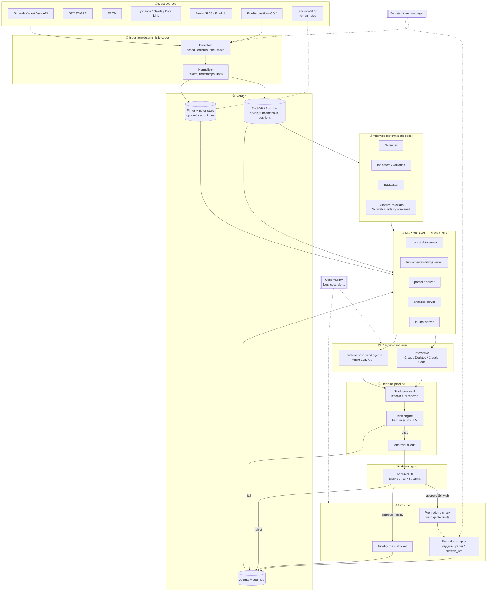
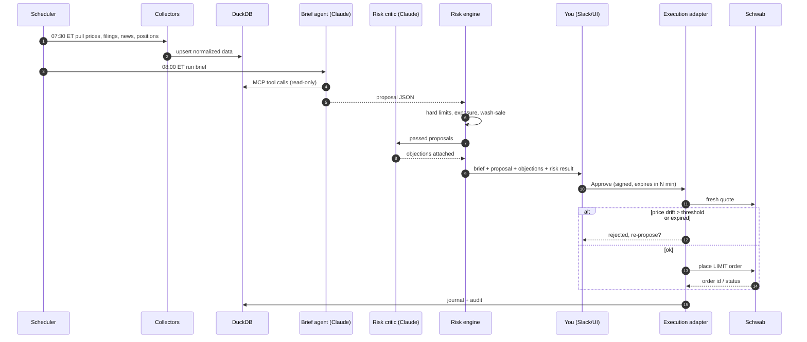
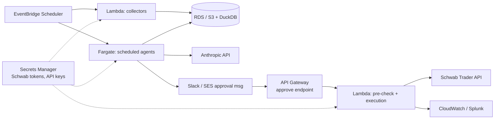

The best way to use Claude here is to build the tools once as MCP servers and use them from two places: interactively (you chatting with Claude Desktop or Claude Code) and on a schedule (an agent running headless). Your human approval sits at the end of both paths. Below is the full high-level design, followed by how I'd answer the "better way" question.

## 1. Logical architecture

**Core design rule:** no MCP tool that Claude can call is able to place an order. Claude's only "write" action is producing a proposal. Execution is reachable only through the approval UI.

## 2. Component reference

| # | Component | Responsibility | Tech (suggested) | LLM? |
|---|---|---|---|---|
| ① | Data sources | Prices, chains, fundamentals, filings, macro, news, holdings | Schwab MD API, EDGAR, FRED, yfinance, Finnhub | No |
| ② | Collectors / normalizer | Scheduled pulls, retries, rate limits, symbol mapping | Python + APScheduler or EventBridge | No |
| ③ | Storage | Time series, fundamentals, positions, filings text, journal | DuckDB (start) → Postgres; S3 for raw docs | No |
| ④ | Analytics | Screens, indicators, valuation, backtests, combined exposure | pandas, vectorbt, pandas-ta | No |
| ⑤ | MCP servers | Read-only tool interface over ③ and ④ | Python MCP SDK, one server per domain | No |
| ⑥a | Interactive agent | Your research cockpit: ad-hoc questions, thesis work | Claude Desktop / Claude Code + your MCP servers | **Yes** |
| ⑥b | Scheduled agents | Pre-market brief, filing watch, post-close review, weekly review | Claude Agent SDK or Messages API + cron/EventBridge | **Yes** |
| ⑦ | Proposal + risk engine | Validate schema; enforce position, sector, and loss caps; wash-sale check | Pydantic + pure Python rules | No |
| ⑧ | Approval UI | Show proposal, rationale, risk result; approve or reject | Slack interactive message, or Streamlit page | No |
| ⑨ | Pre-trade re-check | Re-quote at approval time; reject if price moved > X% or the proposal is stale | Python | No |
| ⑨ | Execution adapter | One interface, three backends | `schwab-py` / Alpaca paper / dry-run | No |
| — | Secrets / token mgr | Schwab OAuth (30-min refresh, 7-day re-auth alert), API keys | OS keyring or AWS Secrets Manager | No |
| — | Observability | Prompts, tool calls, proposals, fills, token cost, failures | JSON logs → Splunk/Loki, or a simple dashboard | No |

The LLM appears in only one row group. Everything that touches money or numbers is deterministic.

## 3. Agent roles

Split the work into narrow agents instead of one general one:

| Agent | Trigger | Inputs (tools) | Output | Model tier |
|---|---|---|---|---|
| **News triage** | Every 30 min, market hours | news, watchlist | Relevance and tone tags → DB | Small/fast (Haiku-class) |
| **Filing watcher** | EDGAR poll | filings server | Material-change summary + alert | Mid (Sonnet-class) |
| **Pre-market brief** | 08:00 ET | all read tools | Markdown brief + 0–N proposals | Mid/top |
| **Thesis writer** | On demand / screen hit | fundamentals, filings, your SWS notes | Bull/bear/invalidation write-up | Top (Opus-class) |
| **Risk critic** | Each proposal | proposal + portfolio | "Red-team" objections attached to the proposal | Mid |
| **Post-trade reviewer** | Weekly | journal | Process vs. outcome review | Mid |

The **risk critic** is a cheap, high-value addition: a second Claude call whose only job is to argue against the trade. You see both views at approval time.

**Prompt-injection boundary:** the news triage agent reads untrusted text, so its output is tags only, never free text passed into the proposal agent's instructions.

## 4. Daily flow (sequence)

Approval-stage details worth building in:
- An approval token that is **single-use and time-boxed** (e.g. 15 min).
- **Limit orders only** by default, with the limit derived from the fresh quote.
- The approval screen shows the **combined Schwab + Fidelity exposure after the trade**.
- One-click "reject + reason," which feeds the weekly review.

## 5. Deployment options

| Option | Fit | Notes |
|---|---|---|
| **Local / home server** | Best to start | Simplest Schwab OAuth callback (`https://127.0.0.1`), zero cloud cost, Claude Desktop connects to local MCP servers directly |
| **AWS (commercial, not GovCloud)** | Once it's stable | EventBridge Scheduler → Lambda/Fargate collectors and agents; RDS or DuckDB-on-S3; Secrets Manager; SNS/SES or Slack for approvals; API Gateway for the OAuth callback and approval endpoints |
| Hybrid | Practical | Scheduled agents and collectors in AWS; interactive Claude Desktop locally, pointing at remote MCP servers over an authenticated endpoint |

Keep the execution Lambda in its own IAM role with access to the Schwab secret. No other component should be able to read that secret.

## 6. Is there a better way to use Claude?

There are three maturity levels. Each one reuses the previous level's work, so you never throw anything away.

| Level | What it is | Effort | When it's enough |
|---|---|---|---|
| **L1: Research copilot** | A claude.ai Project with your investing notes and SWS write-ups; you paste data in and ask questions | Hours | Long-term investing, a few trades a month |
| **L2: Cockpit (recommended next step)** | Your read-only MCP servers (Schwab market data, EDGAR, DuckDB, portfolio) connected to Claude Desktop or Claude Code. You ask "screen my watchlist for X," "compare Q3 filings for Y," "what's my combined semis exposure?", and you place trades yourself | 1–3 weekends | Most self-directed traders, and you get ~70% of the value |
| **L3: Scheduled agents + approval pipeline** | The full design above | Several weeks | You want daily briefs, monitoring, and structured proposals without asking |

My recommendation: **build L2 first.** The MCP servers are the core asset. Once they exist, L3 is mostly a scheduler, a proposal schema, a risk engine, and an approval UI wrapped around the same tools. You also get weeks of hands-on feel for how Claude reasons over your data before you trust it to generate proposals.

## 7. Build sequence

1. **Data + storage:** collectors for EDGAR, FRED, yfinance, and Fidelity CSV into DuckDB. Add Schwab market data once your developer access is approved.
2. **MCP servers (read-only)** and hookup to Claude Desktop. **This is your L2 milestone.**
3. **Analytics:** screens, exposure calculator, backtester exposed as MCP tools.
4. **Proposal schema + risk engine + journal**, with the execution adapter in `dry_run`.
5. **Scheduled pre-market brief agent + risk critic.**
6. **Approval UI** (Slack or Streamlit) + pre-trade re-check.
7. **Execution:** `alpaca_paper` for a few weeks, then `schwab_live` in a small isolated account.
8. **Weekly reviewer + cost/quality dashboards.**

